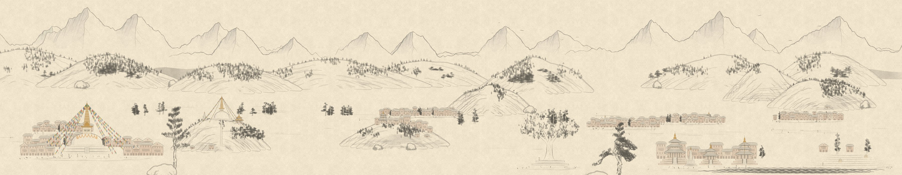
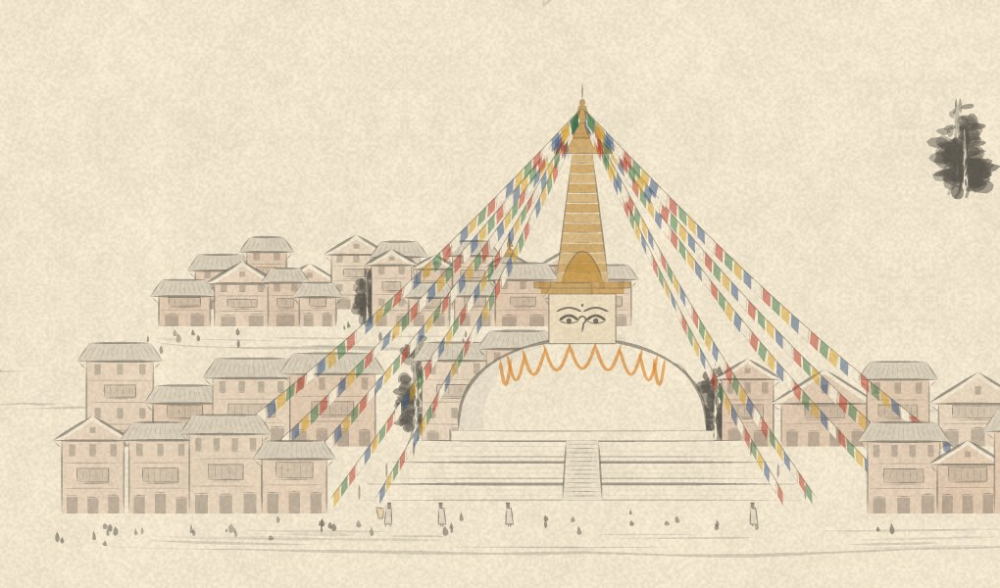
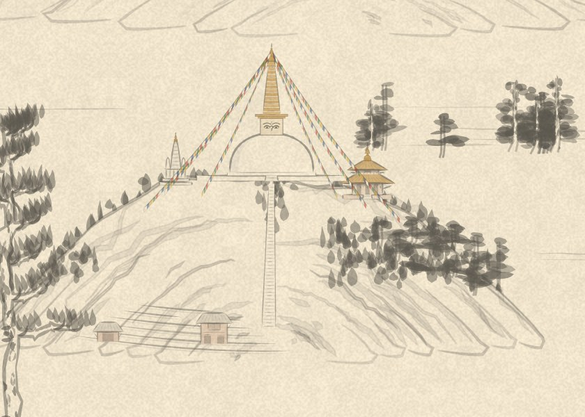
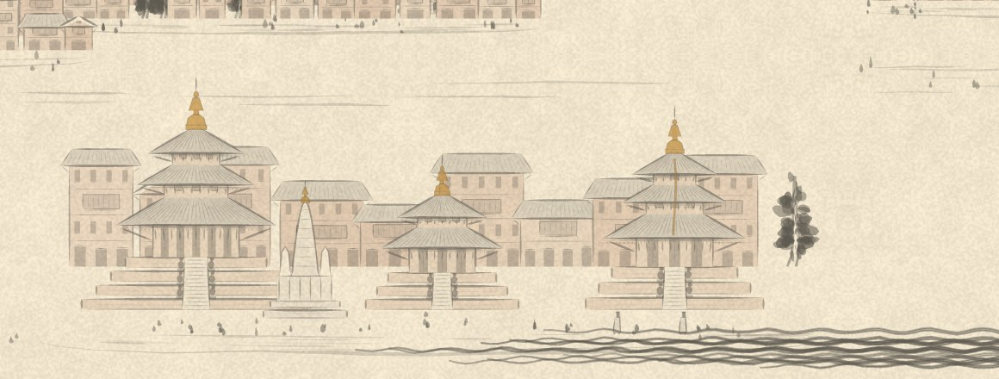
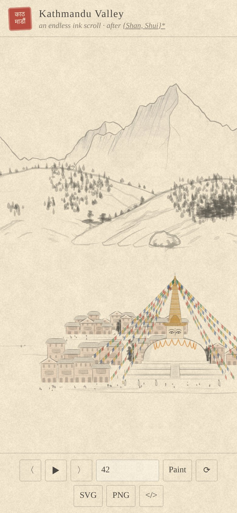

# Kathmandu Valley

An endless, procedurally generated ink scroll of the Kathmandu Valley, drawn in the browser as SVG. It is built on [{Shan, Shui}\*](https://github.com/LingDong-/shan-shui-inf), Lingdong Huang's infinite Chinese landscape, whose noise, brushes and trees do the painting. This project adds the valley: Himalayan snow peaks, forested rim hills, Newari towns, pagodas and stupas.



Every seed paints a different valley, and the scroll never ends in either direction.

## What's in the scroll

| | |
|---|---|
|  |  |

- **The Himalaya** along the northern horizon: snow massifs with shaded west faces, ridges and dark rock under the crests.
- **The rim of the valley**: two ranks of forested hills (think Shivapuri, Nagarjun, Phulchoki, Chandragiri), with rice terraces, hamlets and the odd hilltop temple.
- **Swayambhu**: a stupa on a wooded hill, with a stairway up the front, small shrines beside it and prayer flags strung down the slopes.
- **Boudhanath**: the great white dome on its stepped mandala terraces, the Buddha's eyes, thirteen gilded rings, saffron lotus arcs and flags, ringed by houses.
- **Durbar squares**: tall pagodas on stepped plinths with guardian figures on the stairs (up to a five-roofed temple on five plinths, like Nyatapola), a stone shikhara like Krishna Mandir, and a king on a pillar under a cobra hood.
- **Newari towns**: brick houses with latticed windows, tiled roofs and shopfronts, temples rising between them, and quarters of the city spread across the valley floor.
- **Bahals**: courtyards of stone chaityas around a gilded shrine.
- **Chautaras**: stone resting platforms around a big pipal tree.
- **Paddy terraces** with straw haystacks, farmhouses, porters with doko baskets, black kites wheeling overhead, and the river.



## Run it

Open `index.html` in a browser. That's all; there is nothing to install.

Opened straight from disk, the page paints on the main thread. Served over http it paints in Web Workers, which keeps dragging smooth:

```sh
python3 -m http.server 8000     # or: npm run serve
# then open http://localhost:8000/?seed=42
```

To publish it, turn on GitHub Pages for this repository (Settings → Pages → deploy from the `main` branch, root folder). The page is static, so it works as is.

### Controls

| | |
|---|---|
| Drag, swipe or scroll | travel along the valley |
| `←` `→` or `〈` `〉` | glide west or east |
| `space` or `▶` | auto-scroll |
| Seed box + **Paint** | paint a seed (also `?seed=…` in the URL) |
| `⟳` | a fresh random seed |
| **SVG** / **PNG** | download the current view |

The same seed always gives the same scroll, in any browser and on the command line, so a seed is a shareable address for a painting.



### Render from the command line

```sh
node scripts/render.js --seed 42 --width 3600 --out valley.svg
npm install                      # once, for PNG output (uses resvg)
node scripts/render.js --seed 42 --x 6000 --width 1800 --scale 2 --out valley.png
```

`--x` is where the stretch starts and `--width` how long it is, in the painting's units (the scroll is 700 units tall).

### One-file build

```sh
node scripts/build.js            # -> dist/kathmandu-valley.html
```

bundles the page and its scripts into a single HTML file you can send or host anywhere.

<br clear="right" />

## How it works

The pipeline follows {Shan, Shui}\*: **cosine curves + noise → layered mountains → brush strokes and trees → a seeded landscape → SVG**.

1. **Shapes from noise.** Hills are cosine humps whose height is modulated by Perlin noise, stacked in layers that shrink upward. The Himalaya are built differently: a ridge line taken as the highest of several sharp "tents", roughened with ridged noise, so peaks come to points.
2. **Ink.** Everything is drawn with the engine's brushes: `stroke` (a polyline swelled by a width function), `blob` (leaves and dabs), `texture` (the hatching on hills) and `poly` (washes and paper-white masks). Snow faces get several feathered washes plus hatching; buildings get flat watercolour tints in brick, gold and saffron.
3. **Motifs.** `src/kathmandu.js` builds pagodas, stupas, houses, flags and the rest from those brushes, each as a function of position, size and a few style knobs.
4. **A seeded plan.** `src/valley.js` cuts the scroll into 512-unit chunks. Each chunk reseeds the random generator from the seed and its index, so a stretch looks the same however you reach it. Snow peaks, hills and the city sit on regular grids with jitter; the main sites (Boudha, Swayambhu, Durbar squares, towns, fields…) are dealt from a shuffled deck, so every motif appears regularly and neighbours never repeat. Items are painted back to front by depth.
5. **SVG.** Each motif returns SVG markup as a string. The viewer (`src/app.js`) mounts what is near the view, slides it with a CSS transform, paints new chunks ahead of you and forgets far ones. Exports wrap the visible stretch in a standalone SVG with the paper texture.

### Files

```
index.html          the viewer page
src/shanshui.js     the {Shan, Shui}* drawing engine (lightly modified, see below)
src/kathmandu.js    Kathmandu Valley motifs
src/valley.js       the endless planner, chunk cache and SVG export
src/app.js          scrolling, workers, controls and downloads
scripts/render.js   command-line renderer (SVG, or PNG via resvg)
scripts/build.js    single-file build
```

## Credits

The drawing engine is from **[{Shan, Shui}\*](https://github.com/LingDong-/shan-shui-inf) by Lingdong Huang** (MIT, 2018): the seeded PRNG, Perlin noise (from p5.js), polygon tools, brushes, trees, mountains, rocks, water and figures. Changes made to it in `src/shanshui.js`:

- moved out of the page into a standalone script that runs in browsers, workers and Node (no DOM access)
- the seed hash is a 53-bit string hash instead of `window.btoa`, so long seeds work everywhere
- a few accidental globals made local
- the shop-sign easter egg removed from `Arch.arch02`
- `Mount.foot` and `Man.tranpoly` exposed for reuse
- the original planner, chunk loader and UI removed (replaced by `valley.js` and `app.js`)

Everything Kathmandu-specific is new.

## License

MIT, see [LICENSE](LICENSE). The engine remains © 2018 Lingdong Huang under its original MIT license.
